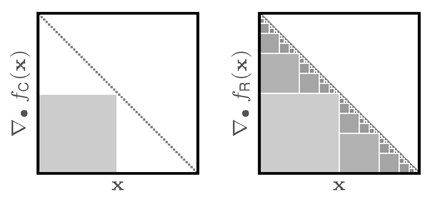
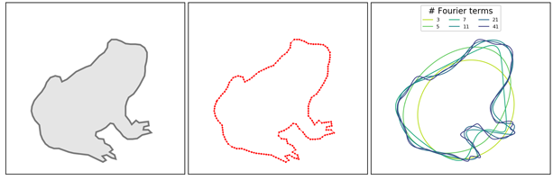

# HINT
Code for the research paper "HINT: Hierarchical Invertible Neural Transport for Density Estimation and Bayesian Inference".





A pre-print is available at [arXiv](https://arxiv.org/abs/1905.10687), for now please cite as:
```
@misc{kruse2019hint,
    title = {HINT: Hierarchical Invertible Neural Transport for Density Estimation and Bayesian Inference},
    author = {Jakob Kruse and Gianluca Detommaso and Robert Scheichl and Ullrich K\"othe},
    year = {2019},
    eprint = {1905.10687},
    archivePrefix = {arXiv}
}
```


### Requirements

In order to run the code, you will need the following:

+ `PyTorch` (>= v1.0.0)
+ `Python` (>= v3.7)
  + Packages `numpy`, `scipy`, `pandas`, `shapely`, `matplotlib`, `tqdm` & `visdom`
+ [`FrEIA`](https://github.com/VLL-HD/FrEIA/)


Alternatively, you can [load a conda environment](https://docs.conda.io/projects/conda/en/latest/user-guide/tasks/manage-environments.html#creating-an-environment-from-an-environment-yml-file) with all dependencies by invoking:

``` shell
$ conda env create -f environment.yml
```

This will create a `cpuonly` environment to run HINT.


### Structure

There is one script for [training unconditional models](../master/train_unconditional.py) and one for [training conditional models](../master/train_conditional.py).
These scripts expect a running `visdom` server for [visualization](../master/monitoring.py) and the import of a config file specifying the model and hyperparameters.
Config files for all models used in the paper are supplied in the directory [configs](../master/configs).

The recursive affine coupling block is implemented as a `FrEIA`-compatible module in [hint.py](../master/hint.py) and will be officially added to the framework in the future.

Data sets for training and evaluation are managed with [an additional script](../master/data.py), but note that we maintain [another repository](https://github.com/VLL-HD/inn_toy_data) with the latest versions of all our toy data sets. The script also provides data loaders for three common UCI density estimation benchmarks, with download instructions. Code for the plots used in our paper is found in [plot_data.py](../master/plot_data.py).

The [last script file](../master/rejection_sampling.py) deals with the rejection sampling baseline and systematic comparisons between the trained models. The first run of this script will take some time as the baseline is very inefficient, but results are stored and subsequent runs go much faster.
